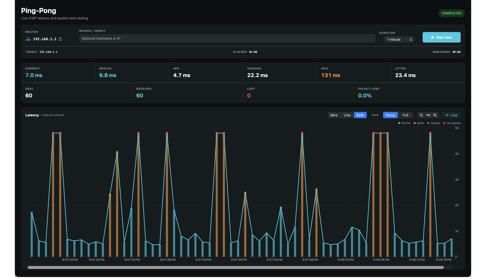

<p align="center">
  
</p>

<h1 align="center">Ping-Pong</h1>

<p align="center">
  A native macOS router latency and packet-loss monitor.
</p>



Ping-Pong finds the active router on your Mac, sends one ICMP ping per second, and plots latency and packet loss as the test runs.
It is built with SwiftUI and Swift Charts, stores only the current session in memory, and does not require administrator access.

## Features

- Automatically detects the active default gateway on Wi-Fi, Ethernet, and VPN connections.
- Accepts a safe manual hostname, IPv4 address, or IPv6 address.
- Runs 1, 5, 15, 30, or 60-minute tests, custom durations, or an unlimited test.
- Shows current, median, minimum, average, maximum, and jitter values.
- Tracks packets sent, received, lost, and total packet-loss percentage.
- Displays bars, a line, or both at the same time.
- Marks normal replies in cyan, spikes in orange, clipped outliers in red, and packet loss with red columns.
- Provides Focus and Full scales, hover tooltips, Live following, horizontal scrolling, and zoom controls.
- Keeps long sessions responsive with bounded adaptive chart buckets.
- Stops the ping process cleanly when the test ends, the user stops it, or the app quits.

## Install from the DMG

1. Download `Ping-Pong-<version>.dmg` from the GitHub Releases page.
2. Open the DMG.
3. Drag `Ping-Pong.app` onto the Applications shortcut.
4. Launch Ping-Pong from Applications.

The locally generated DMG is ad hoc signed and is not notarized by Apple.
On first launch, Control-click Ping-Pong, choose **Open**, then confirm **Open**.
A Developer ID signed and notarized release opens normally without this extra step.

## Requirements

- macOS 14 Sonoma or newer.
- Apple Silicon or Intel Mac.
- No administrator access.
- No background service.

The packaged application is a universal binary containing both `arm64` and `x86_64` architectures.

## Use Ping-Pong

1. Confirm the detected router or enter a manual target.
2. Select a duration.
3. Click **Start test**.
4. Switch between Bars, Line, and Both while the test is running.
5. Use Focus for a fixed 0 to 50 ms view or Full for an expanding view of larger spikes.
6. Use the zoom controls and Live button to inspect or follow a long session.

A spike is a reply above 20 ms and more than twice the running median.
Jitter is the average absolute latency difference between consecutive successful replies.

## Build from source

Install Apple Command Line Tools, clone the repository, then run:

```sh
make test
make app
open "dist/Ping-Pong.app"
```

Create the installable DMG with:

```sh
make dmg
```

Release artifacts are written to `dist`:

- `Ping-Pong.app`
- `Ping-Pong-1.0.0.dmg`

Set a different version when building with:

```sh
APP_VERSION=1.1.0 make dmg
```

## Publish a GitHub release

The release workflow runs the tests, builds the universal app and DMG, verifies the architectures, uploads the artifact, and creates release notes.

Push a version tag to publish a release:

```sh
git tag v1.0.0
git push origin v1.0.0
```

The workflow can also be started manually from the GitHub Actions page with a version value.

## Developer ID signing and notarization

Apple notarization requires an Apple Developer account and a Developer ID Application certificate.
Create a notarytool keychain profile once:

```sh
xcrun notarytool store-credentials PingPongNotary
```

Build the app and DMG with your Developer ID identity:

```sh
CODESIGN_IDENTITY="Developer ID Application: Your Name (TEAMID)" \
APP_VERSION=1.0.0 \
make dmg
```

Submit, staple, and validate the DMG:

```sh
CODESIGN_IDENTITY="Developer ID Application: Your Name (TEAMID)" \
NOTARY_PROFILE="PingPongNotary" \
APP_VERSION=1.0.0 \
make notarize
```

## Privacy and permissions

Ping-Pong launches the built-in `/sbin/ping` utility and reads the default route with `/sbin/route`.
It does not use analytics, upload results, persist test history, request administrator access, or install a helper service.

The App Sandbox is intentionally disabled because the application launches these built-in networking utilities.

## Project structure

```text
Sources/PingPong/       SwiftUI app, session model, and network services
Tests/PingPongTests/    Standalone parser, statistics, and chart tests
Resources/              Editable icon source and generated macOS icon
docs/images/            GitHub documentation images
scripts/                Test, app, DMG, icon, and notarization scripts
.github/workflows/      Continuous integration and release automation
```
